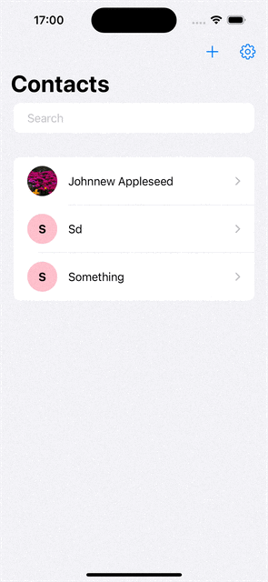

#  SwiftUI: Contact App Copy Cat

A demo of using Contacts and ContactsUI framework for working with user contacts.
 
Specifically, following abilities are included.
1. Request access and manage permission
2. fetch contacts 
3. In the case of limited(partial) access, have our user choose contacts to share with our app
4. Display, Edit, Add, Delete Contacts
5. Listen to contacts changes
 
For displaying, editing, and adding contacts, two different approaches.
1. With the ContactsUI framework. By using this approach, all we have to do is to show the UI provided and leave the rest to the system.
2. With our own interface. This approach requires managing all those interactions with the contacts database by ourselves but do provide us more control on the information we acquires from the user.

